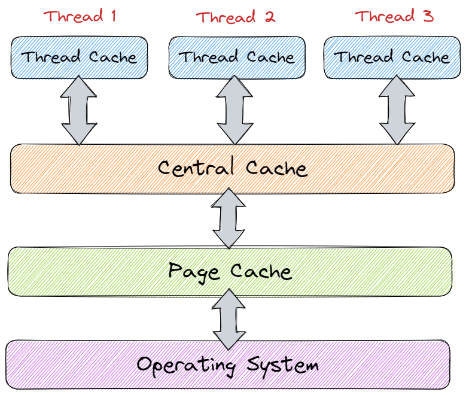
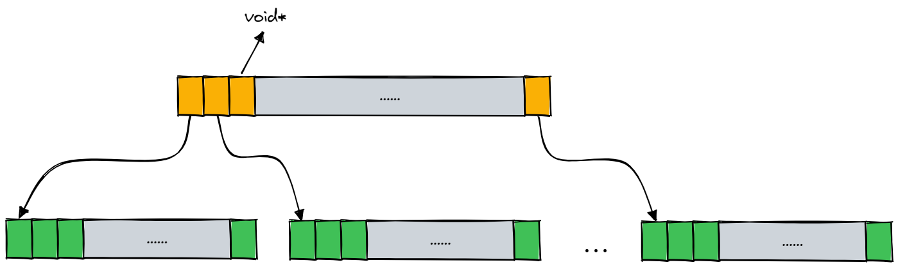

# Apollo

使用 C/C++ 开发的一款高性能的后端分布式服务器网络框架。该项目具有如下要点：

- 使用 C++11 重写并简化 [muduo](https://github.com/chenshuo/muduo) 网络库；
- 仿写了 [tcmalloc](https://github.com/google/tcmalloc) 的高并发内存池；
- 加入了 [sylar](https://github.com/sylar-yin/sylar) 的日志模块并将其改进为异步日志(异步日志未实现)；
- 使用 [protobuf](https://github.com/protocolbuffers/protobuf) 来进行 RPC 序列化/反序列化；
- 使用 [Zookeeper](https://zookeeper.apache.org/) 来作为分布式的注册和发现服务；

## 项目部署

### 1. 开发环境

- OS：Ubuntu 22.04 LTS
- 构建工具：CMake 3.16.3
- 编译器：GCC 9.4.0
- 调试器：GDB 9.2
- 第三方模块：
    - [json.cpp](https://github.com/nlohmann/json)：3.11.2
    - protobuf：3.17.0
    - ZooKeeper：3.4.10

### 2. 如何编译

首先安装相应的 protobuf 库和 zookeeper 库，然后打开 autobuild.sh 文件，将如下内容更改为自己所配置的 protobuf 路径：

```sh
cd $BUILD_DIR &&
  cmake -DCMAKE_PREFIX_PATH=your_path -DCMAKE_INSTALL_PREFIX=/usr/local/apollo .. &&
  make install
```

运行 `autobuild.sh` 直接进行编译、安装即可，默认情况下安装在 `usr/local/apoll` 路径下，如果需要更改安装路径，那么更改 autobuild.sh 的如下内容即可：

```sh
cd $BUILD_DIR &&
  cmake -DCMAKE_PREFIX_PATH=/usr/local/protobuf -DCMAKE_INSTALL_PREFIX=obj_path .. &&
  make install
```

如果不需要采用 tcmallloc 内存池模块，而是采用系统原生的 malloc/free，那么更改 autobuild.sh 的如下内容即可：

```sh
cd $BUILD_DIR &&
  cmake -DCMAKE_PREFIX_PATH=/usr/local/protobuf -DCMAKE_INSTALL_PREFIX=/usr/local/apollo -DTCMALLOC=OFF .. &&
  make install
```

如果需要采用 poll 而非 epoll 来作为 I/O 复用模型，那么修改 autobuild.sh 的如下内容即可：

```sh
cd $BUILD_DIR &&
  cmake -DCMAKE_PREFIX_PATH=/usr/local/protobuf -DCMAKE_INSTALL_PREFIX=/usr/local/apollo -DAPLUSEPOLL=ON .. &&
  make install
```

> 默认情况下，运行 autobuild.sh 文件时会启用 tcmalloc 内存池，同时使用 epoll 来作为 I/O 复用模型。

注意，使用该框架时需要在可执行文件的所在路径下添加 `config.json` 配置文件，以配置日志、节点服务器、发现服务器等信息。

### 3. 配置文件

配置文件位于可执行文件的所在路径下，且名为 `config.json`，如下是其示例配置：

```json
{
  "log": [
    {
      "name": "root",
      "level": "INFO",
      "formatter": "%d{%Y-%m-%d %H:%M:%S}%T%t%T%c%T[%p]%T%f:%l%T%m%n",
      "appenders": [
        {
          "type": "file",
          "file": "./log/root.txt",
          "async": false
        },
        {
          "type": "stdout"
        }
      ]
    },
    {
      "name": "rpc",
      "level": "DEBUG",
      "formatter": "%d{%Y-%m-%d %H:%M:%S}%T%t%T%c%T[%p]%T%f:%l%T%m%n",
      "appenders": [
        {
          "type": "file",
          "file": "./log/rpc.txt",
          "async": false
        }
      ]
    }
  ],
  "rpc": {
    "ip": "127.0.0.1",
    "port": 8000,
    "thread": 4
  },
  "zookeeper": {
    "ip": "127.0.0.1",
    "port": 5000
  }
}
```

其中，配置信息主要由如下三部分组成：

- log：日志配置信息
    - name：日志名称
    - level：日志等级，支持DEBUG、INFO、WARN、ERROR、FATAL
    - formatter：日志格式
    - appenders：日志输出目的地，可以配置多个
        - type：日志类型，支持file(文件)、stdout(标准输出)
        - file：文件名称
        - async：是否为异步日志(目前尚未支持)
- rpc：RPC节点配置信息
    - ip：IP地址
    - port：端口号
    - thread：线程数目
- zookeeper：发现服务器的配置信息
    - ip：IP地址
    - port：端口号

对于日志格式而言，所支持的字段如下：

| 格式化字符 | 含义     |
| ---------- | -------- |
| %m         | 消息内容 |
| %p         | 日志等级 |
| %c         | 日志名称 |
| %t         | 线程ID   |
| %n         | 换行符   |
| %d         | 日志时间 |
| %f         | 文件名   |
| %l         | 行号     |
| %T         | 制表符   |
| %N         | 线程名称 |

> 时间的格式化字符见 `strftime` 函数。

### 4. 如何使用

首先需要通信双方约定消息格式，示例文件如下，其中 `option cc_generic_services = true` 必须开启：

```proto
syntax = "proto3";

package fixbug;

option cc_generic_services = true;

message ResultCode {
    int32 errcode = 1;
    bytes errmsg = 2;
}

message LoginRequest {
    bytes name = 1;
    bytes pwd = 2;
}

message LoginResponse {
    ResultCode result = 1;
    bool success = 2;
}

service UserServiceRpc {
    rpc Login(LoginRequest) returns(LoginResponse);
}
```

然后通过如下命令在当前路径下生成相应的头文件和源文件，该头文件中会包含两个类：`UserServiceRpc` 和 `UserServiceRpc_Stub`：

```sh
proto xxx.proto --cpp_out=./
```

对于服务提供方而言，需要继承 `UserServiceRpc` 类，并重写相应的方法，如下所示：

```c++
class UserService : public UserServiceRpc {
  bool Login(const std::string& name, const std::string& pwd) {
    // 实现业务方法...

    return true;
  }

  // 重新基类方法
  void Login(::google::protobuf::RpcController* controller,
    const ::fixbug::LoginRequest*             request,
    ::fixbug::LoginResponse*                  response,
    ::google::protobuf::Closure*              done) override {
    // 通过request参数获取请求方的函数参数
    std::string name = request->name();
    std::string pwd  = request->pwd();

    // 执行本地业务
    bool res = Login(name, pwd);

    // 将响应结果写入response参数
    fixbug::ResultCode* code = response->mutable_result();
    code->set_errcode(0);
    code->set_errmsg("");
    response->set_success(res);

    // 执行回调操作
    done->Run();
  }
};

int main() {
  // 把UserService对象发布到RPC节点上
  RpcProvider provider;
  provider.notifyService(new UserService());

  // 启动一个rpc服务发布节点
  provider.run();

  return 0;
}
```

对于服务请求方而言，实例化一个 `UserServiceRpc_Stub` 对象，然后将函数参数放入到 request 对象中，然后通过 `UserService_Stub` 对象执行远程调用即可，最终通过 RpcControllerImpl 得知远程调用是否成功，如果成功则通过 response 对象取出服务请求的结果即可，示例代码如下：

```c++
int main() {
  fixbug::UserServiceRpc_Stub stub(new apollo::RpcChannelImpl);
  fixbug::LoginRequest        request;
  request.set_name("zhang san");
  request.set_pwd("123456");
  fixbug::LoginResponse response;
  // 发起RPC同步调用
  apollo::RpcControllerImpl controller;
  stub.Login(&controller, &request, &response, nullptr);

  if (controller.Failed()) {
      std::cout << controller.ErrorText() << std::endl;
  } else {
      // RPC调用完成 读取结果
      if (response.result().errcode() == 0) {
          std::cout << "rpc login response: " << response.success() << std::endl;
      } else {
          std::cout << "failed to rpc login: " << response.result().errmsg() << std::endl;
      }
  }
  return 0;
}
```

## 内存池模块

该项目所使用的内存池原型是 Google 的开源项目 tcmalloc，其全称为 Thread-Caching Malloc，即线程缓存的 malloc，实现了高效的多线程内存管理，用于替换系统的内存分配相关函数，即 malloc 和 free。

内存池主要解决的就是效率问题，它能够避免让程序频繁的向系统申请和释放内存。其次，内存池作为系统的内存分配器，还需要尝试解决内存碎片的问题，内存碎片分为如下两种：

- **外部碎片**：指的是空闲的小块内存区域，由于这些内存空间不连续，以至于合计的内存足够，但是不能满足一些内存分配的需求。
- **内部碎片**：指的是由于一些对齐的需求，导致分配出去的空间中一些内存无法被充分利用。

> 内存池尝试解决的是外部碎片的问题，同时也尽可能的减少内部碎片的产生。

该内存池的整体架构如下图所示：

<div align="center">

</div>

其主要由以下三个部分组成：

- `Thread Cache`: 线程缓存是每个线程独有的，用于小于等于 256KB 的内存分配，每个线程独享一个 ThreaCache了。
- `Central Cache`: 中心缓存是所有线程共享的，当 ThreadCache 需要内存时会按需从 CentralCache 中获取内存，而当 ThreadCache 中的内存满足一定条件时，CentralCache 也会在合适的时机对其进行回收。
- `Page Cache`: 页缓存中存储的内存是以页为单位进行存储及分配的，当 CentralCache 需要内存时，PageCache 会分配出一定数量的页给 CentralCache，而当 CentralCache 中的内存满足一定条件时，PageCache 也会在合适的时机对其进行回收，并将回收的内存尽可能的进行合并，组成更大的连续内存块，缓解内存碎片的问题。

上述三个部分的主要作用如下：

- Thread Cache: 主要解决锁竞争的问题；
- Central Cache: 主要负责居中调度的问题；
- Page Cache: 主要负责提供以页为单位的大块内存；

### 1.ThreadCache

Thread Cache 的结构如下图所示：

<div align="center">

</div>

通过使用**字节对齐**的方法来减少哈希桶的数目，并且进一步增加内存利用率，在设计时，让不同的范围的字节数按照不同的对齐数进行对齐，具体的对齐方式如下：

| 字节数                 | 对齐数 | 哈希桶下标 | 自由链表数目 |
| ---------------------- | ------ | ---------- | ------------ |
| \[1, 128]               | 8      | [0, 16)    | 16           |
| \[129, 1024]            | 16     | [16, 72)   | 56           |
| \[1025, 8\*1024]         | 128    | [72, 128)  | 56           |
| \[8\*1024+1, 64\*1024]   | 1024   | [128, 184) | 56           |
| \[64\*1024+1, 256\*1024] | 8\*1024 | [184, 208) | 24           |

为了实现每个线程无锁访问属于自己的 Thread Cache，就需要用到**线程局部存储**(Thread Local Storage, TLS)，使用该存储方法的变量在它所在的线程是全局可访问的，但是不能被其它线程访问到，这样就保证了数据的线程独立性。

当某个线程申请的对象不用了，可以将其释放给 Thread Cache，然后 Thread Cache 将该对象插入到哈希桶的自由链表当中即可。

但是随着线程不断地释放，对应自由链表中的长度也会越来越长，这些内存堆积在一个 Thread Cache 中就是一种浪费，此时应该将这些内存还给 Central Cache，这样一来，这些内存对于其它线程来说就是可申请的，因此当 Thread Cache 中某个桶当中的自由链表太长时，可以将其释放给 Central Cache。

### 2. CentralCache

当线程申请某一大小的内存时，如果 Thread Cache 中对应的自由链表不为空，那么直接取出一个内存块返回即可，但如果此时该自由链表为空，那么这时 Thread Cache 就需要向 Central Cache 申请内存了。

Central Cache 的结构与 Thread Cache 是一样的，都是哈希桶结构，并且所遵循的对齐规则也一致。这样做的好处是当 Thread Cache 的某个桶中没有内存时，就可以直接到 Central Cache 中相对应的哈希桶中取内存。

Central Cache 与 Thread Cache 不同之处有两点：

1. Central Cache 是所有线程共享的，而 Thread Cache 是线程独享的；
2. Central Cache 的哈希桶中挂载的是 Span，而 Thread Cache 的哈希桶中挂载的是切好的内存块；

其结构如下所示：

<div align="center">

</div>

由于 Central Cache 是所有线程共享的，多个 Thread Cache 可能在同一时刻向 Central Cache 申请内存块，因此为了保证线程安全，需要加锁控制。此外，由于只有多个线程同时访问 Central Cache 的同一个桶时才会存在锁竞争，因此无需用锁来锁住所有哈希桶，只需锁住当前所访问的哈希桶即可。

当 Thread Cache 向 Central Cache 申请内存时，如果给的太少，那么 Thread Cache 在短时间用完了又会再来申请；但是如果给的太多，那么 Thread Cache 可能用不完而浪费大量的空间。为此，此处采用**慢反馈调节算法**，当 Thread Cache 向 Central Cache 申请内存时，如果申请的是较小的对象，那么可以多给一点，但如果申请的是较大的对象，就可以少给一点。

当 Thread Cache 中的某个自由链表太长时，会将自由链表中的对象归还给 Central Cache 中的 Span。但是需要注意的是，归还给 Central Cache 的这些对象不一定都属于同一个 Span 的，且 Central Cache 中的每个哈希桶中都可能不止一个 Span，因此归还时不仅需要知道该对象属于哪一个桶，还需要知道它属于这个桶中的哪一个 Span。为了建立页号和 Span 之间的映射，需要使用一种哈希表结构进行管理，一种方式是采用 C++ 中的 unordered_map，另一种方式是采用**基数树**数据结构。

### 3. PageCache

Page Cache 的结构与 Central Cache 一样，都是哈希桶的结构，并且 Page Cache 的每个哈希桶中都挂的是一个个的 Span，这些 Span 也是按照双向链表的结构连接起来的。

但是，Page Cache 的映射规则与 Central Cache 和 Thread Cache 不同，其采用的是**直接定址法**，比如 1 号桶挂的都是 1 页的 Span，2 号桶挂的都是 2 页的 Span，以此类推。

其次，Central Cache 每个桶中的 Span 都被切为了一个个对应大小的对象，以供 Thread Cache 申请。而 Page Cache 服务的是 Central Cache，当 Central Cache 中没有 Span 时，向 Page Cache 申请的是某一固定页数的 Span。而如果切分这个申请到的 Span 就应该由 Central Cache 自己来决定。

其结构如下图所示：

<div align="center">

</div>

当每个线程的 Thread Cache 没有内存时都会向 Central Cache 申请，此时多个线程的 Thread Cache 如果访问的不是 Central Cache 的同一个桶，那么这些线程是可以同时进行访问的。这时 Central Cache 的多个桶就可能同时向 Page Cache 申请内存，所以 Page Cache 也是存在线程安全问题的，因此在访问 Page Cache 时也必须要加锁。

但是此处的 Page Cache 不能使用桶锁，因为当 Central Cache 向 Page Cache 申请内存时，Page Cache 可能会将其他桶中大页的 Span 切小后再给 Central Cache。此外，当 Central Cache 将某个 Span 归还给 Page Cache 时，Page Cache 也会尝试将该 Span 与其它桶当中的 Span 进行合并。

也就是说，在访问 Page Cache 时，可能同时需要访问多个哈希桶，如果使用桶锁则可能造成大量频繁的加锁和解锁，导致程序的效率底下。因此在访问 Page Cache 时没有使用桶锁，而是用一个大锁将整个 Page Cache 锁住。

如果 Central Cache 中有某个 Span 的 `useCnt_` 减到 0 了，那么 Central Cache 就需要将这个 Span 归还给 Page Cache 了。为了缓解内存碎片问题，Page Cache 还需要尝试将还回来的 Span 与其它空闲的 Span 进行合并。

### 4. 基数树

由于在 PageCache 中最初建立页号与 Span 之间的映射关系时，采用的是 unordered_map 数据结构，但是通过性能测试发现，内存池的性能并未优于原生的 malloc/free 接口，因此通过 Visual Studio 的性能分析工具发现性能瓶颈位于 unordered_map 处。

这主要是因为 unordered_map 不是线程安全的，在多线程环境下需要加锁，而大量的加锁则会导致资源的消耗和性能的下降，因此在映射页号与 Span 之间的关系时，采用基数树（Radix Tree）数据结构来进行优化。

当采用如下图所示的单层基数树时，在 32 位平台下，以一页大小为 8K($2^{13}$) 为例，此时页的数目就是 $2^{32}\div 2^{13}=2^{19}$，因此存储页号最多需要 19 个比特位，同时由于 32 位平台下的指针大小为 4 字节，因此该数组的大小就是 $2^{19}\times 4=2^{21}=2M$，内存消耗不大，是可行的。但是如果是在 64 位平台下，此时该数组的大小就是 $2^{51}\times 8=2^{54}=2^{24}G$，这显然是不可行的：

<div align="center">

</div>

如下图所示，为二层基数树，同样在 32 位平台下，以一页的大小为 8K 为例来说明，此时存储页号最多需要 19 个比特位。而二层基数树实际上就是把这 19 个比特位分为两次进行映射。例如，前 5 个比特位在基数树的第一层进行映射，映射后得到对应的第二层，然后用剩下的比特位在基数树的第二层进行映射，映射后最终得到该页号所对应的 Span 指针。

<div align="center">

</div>

在二层基数树中，第一层的数组占用 $2^5\times 4=2^7$ Bytes 空间，第二层的数组最多占用 $2^5\times 2^{14}\times 4=2^{21}=2M$。二层基数树相比与一层基数树的好处就是，一层基数树必须一开始就把 2M 的数组开辟出来，而二层基数树一开始只需要将第一层的数组开辟出来，当需要进行某一页号映射时再开辟对应的第二层的数组就行了。

在 32 位平台下，一层基数树和二层基数树都是适用的，但是在 64 位平台下，就需要使用下图所示的三层基数树了。三层基数树类似于二层基数树，实际上就是把存储页号的若干比特分为三次进行映射，而且只有当需要建立某一页号的映射关系时，才会开辟对应的数组空间，在一定程度上节约了内存空间：

<div align="center">

</div>

### 5. 性能测试

单线程下内存池性能测试结果如下表所示，其中 `alloc/dealloc` 表示使用内存池来进行内存的申请和分配，而 `malloc/free` 表示使用系统原生的 API 来进行内存的申请和分配，表格中的单位为秒：

| 申请次数 | malloc   | free     | malloc&free | alloc    | dealloc  | alloc&dealloc |
| -------- | -------- | -------- | ----------- | -------- | -------- | ------------- |
| 100      | 0.000108 | 2.2e-05  | 0.00013     | 0.000366 | 6e-05    | 0.000426      |
| 500      | 0.000344 | 0.000111 | 0.000455    | 0.002713 | 0.000235 | 0.002948      |
| 1000     | 0.000935 | 0.000409 | 0.001344    | 0.007691 | 0.000355 | 0.008046      |
| 5000     | 0.021884 | 0.004798 | 0.026682    | 0.007954 | 0.00218  | 0.010134      |
| 10000    | 0.06108  | 0.011623 | 0.071731    | 0.020134 | 0.003578 | 0.023712      |
| 20000    | 0.120307 | 0.028152 | 0.148459    | 0.024508 | 0.006907 | 0.031415      |
| 30000    | 0.199733 | 0.043747 | 0.24348     | 0.03611  | 0.011694 | 0.047804      |

单线程性能测试结果的折线图如下所示：

<div align="center">

</div>

---

多线程下的性能测试结果如下表所示，每个线程都需申请/释放内存 10000 次：

| 线程数目 | malloc   | free     | malloc&free | alloc    | dealloc  | alloc&dealloc |
| -------- | -------- | -------- | ----------- | -------- | -------- | ------------- |
| 1        | 0.06108  | 0.011623 | 0.071731    | 0.06108  | 0.011623 | 0.071731      |
| 2        | 0.2204   | 0.076146 | 0.296546    | 0.059878 | 0.015874 | 0.075752      |
| 3        | 0.613199 | 0.194174 | 0.807373    | 0.156596 | 0.03168  | 0.188276      |
| 4        | 0.492761 | 0.060352 | 0.553113    | 0.492761 | 0.060352 | 0.553113      |
| 5        | 2.65943  | 0.416495 | 3.07592     | 0.680774 | 0.092576 | 0.77335       |
| 6        | 4.16152  | 0.528937 | 4.69046     | 0.815121 | 0.123539 | 0.93866       |
| 7        | 5.43473  | 0.805814 | 6.24054     | 1.18223  | 0.166473 | 1.34871       |

多线程性能测试结果的折线图如下所示：

<div align="center">

</div>

---

综合对比上面的测试数据，可以看出，当申请的内存次数较小时，使用系统原生的 API 更为合适，而如果申请次数过多时，内存池的优势就逐渐体现出来了。

## 网络通信模块

网络通信模块采用的是 muduo 网络库，本项目通过使用 C++11 简化 muduo 网络库，同时去除了 Boost 库的依赖以及一些冗余的组件，提取出 muduo 库中的核心思想，即 One Loop Per Thread。

### 1. Reactor

该网络库采用的是 Reactor 事件处理模式。在《Linux高性能服务器编程》中，对于 Reactor 模型的描述如下：**主线程（即 I/O 处理单元）只负责监听文件描述符上是否有事件发生，有的话就立即将该事件通知工作线程（即逻辑单元）。此外，主线程不做任何其他实质性的工作。读写数据、接受新的连接，以及处理客户请求均在工作线程中完成**。Reactor 模式的时序图如下：

<div align="center">

</div>

而 muduo 网络库的时序图则如下图所示：

<div align="center">

</div>

其次，在《Linux高性能服务器编程》一书中还提到了**半同步/半异步**的并发模式，注意，此处的“异步”与 I/O 模型中的异步并不相同，I/O 模型中的“同步”和“异步”的区分是内核应用程序通知的是何种事件（就绪事件还是完成事件），以及由谁来完成 I/O 读写（是应用程序还是内核）。而在并发模式中，“同步”指的是完全按照代码序列的顺序执行，“异步”则指的是程序的执行需要由系统事件来驱动，比如常见的系统终端、信号等。

而 muduo 库所采用的便是高效的半同步/半异步模式，其结构如下图所示：

<div align="center">

</div>

上图中，主线程只管理监听 socket，连接 socket 由工作线程来管理。当有新的连接到来时，主线程就接受并将新返回的连接 socket 派发给某个工作线程，此后在该 socket 上的任何 I/O 操作都由被选中的工作线程来处理，直到客户关闭连接。主线程向工作线程派发 socket 的最简单的方式，是往它和工作线程之间的管道写数据。工作线程检测到管道上有数据可读时，就分析是否是一个新的客户连接请求到来。如果是，则把新 socket 上的读写事件注册到自己的 epoll 内核事件表中。上图中的每个线程都维持自己的事件循环，它们各自独立的监听不同的事件。因此，在这种高效的半同步/半异步模式中，每个线程都工作在异步模式，所以它并非严格意义上的半同步/半异步模式。

通常情况下，Reactor 模式的实现有如三几种方式：

- Single Reactor - Single Thread
- Single Reactor - Multi Threads
- Multi Reactors - Multi Threads

对于 “Single Reactor - Single Thread” 模型而言，其通常只有一个 epoll 对象，所有的接收客户端连接、客户端读取、客户端写入操作都包含在一个线程内，如下图所示：

<div align="center">

</div>

但在目前的单线程 Reactor 模式中，不仅 I/O 操作在该 Reactor 线程上，连非 I/O 的业务操作也在该线程上进行处理了，这可能会大大延迟 I/O 请求的响应。为了提高服务器的性能，我们需要将非 I/O 的业务逻辑操作从 Reactor 线程中移动到工作线程中进行处理。

为此，可以通过使用线程池模型的方法来改进，即 “Single Reactor - Multi Threads” 模型，其结构如下图所示。将读写的业务逻辑交给具体的线程池来实现，这样可以显示 reactor 线程对 IO 的响应，以此提升系统性能。

<div align="center">

</div>

尽管现在已经将所有的非 I/O 操作交给了线程池来处理，但是所有的 I/O 操作依然由 Reactor 单线程执行，在高负载、高并发或大数据量的应用场景，依然较容易成为瓶颈。

为了继续提升服务器的性能，进而改造出了如下图所示的 “Multi Reactors - Multi Threads” 模型：

<div align="center">

</div>

在这种模型中，主要分为两个部分：mainReactor、subReactors。 mainReactor 主要负责接收客户端的连接，然后将建立的客户端连接通过负载均衡的方式分发给 subReactors，subReactors 则负责具体的每个连接的读写，而对于非 IO 的操作，依然交给工作线程池去做，对逻辑进行解耦。

而在 muduo 网络库中，便采用的是此种模型，每一个 Reactor 都是一个 EventLoop 对象，而每一个 EventLoop 则和一个线程唯一绑定，这也就是 One Loop Per Thread 的含义所在。其中，MainLoop 只负责新连接的建立，连接建立成功后则将其打包为 TcpConnection 对象分发给 SubLoop，在 muduo 网络库中，采用的是 “轮询算法” 来选择处理客户端连接的 SubLoop。之后，这个已建立连接的任何操作都交付给该 SubLoop 来处理。

通常在服务器模型中，我们可以使用 “任务队列” 的方式向 SubLoop 派发任务，即 MainLoop 将需要执行的任务放到任务队列中，而 SubLoop 则从任务队列中取出任务并执行，当任务队列中没有任务时，SubLoop 则进行休眠直到任务队列中有任务出现。但是在 muduo 网络库却中并未采用这一方式，而是采用了另一个更加高效的方式，以便让 MainLoop 唤醒 SubLoop 处理任务。

在上述的 “半同步/半异步” 模式中，我们提到了，主线程向工作线程派发 socket 最简单的方式，就是往它和工作线程之间的管道写数据。为此，我们可以在 MainLoop 和 SubLoop 之间建立管道来进行通信，当有任务需要执行时，MainLoop 通过管道将数据发送给 SubLoop，SubLoop 则通过 epoll 模型监听到了管道上所发生的可读（EPOLLIN）事件，然后调用相应的读事件回调函数来处理任务。

但是在 muduo 库中，则采用了更为高效的 `eventfd()` 接口，它通过创建一个文件描述符用于事件通知，自 Linux 2.6.22 以后开始支持。

> eventfd 在信号通知的场景下，相对比 pipe 有非常大的资源和性能优势，它们的对比如下：
> 1. 首先在于它们所打开的文件数量的差异，由于 pipe 是半双工的传统 IPC 实现方式，所以两个线程通信需要两个 pipe 文件描述符，而用 eventfd 则只需要打开一个文件描述符。总所周知，文件描述符是系统中非常宝贵的资源，Linux 的默认值只有 1024 个，其次，pipe 只能在两个进程/线程间使用，面向连接，使用之前就需要创建好两个 pipe ,而 eventfd 是广播式的通知，可以多对多。
> 2. 另一方面则是内存使用的差别，eventfd 是一个计数器，内核维护的成本非常低，大概是自旋锁+唤醒队列的大小，8 个字节的传输成本也微乎其微，而 pipe 则完全不同，一来一回的数据在用户空间和内核空间有多达 4 次的复制，而且最糟糕的是，内核要为每个 pipe 分配最少 4K 的虚拟内存页，哪怕传送的数据长度为 0。

### 2. I/O multiplexing

在 Linux 系统下，常见的 I/O 复用机制有三种：select、poll 和 epoll。

其中，select 模型的缺点如下：

1. 单个进程能够监视的文件描述符的数量存在最大限制，通常是 1024，当然可以更改数量，但由于 select 采用轮询的方式扫描文件描述符，文件描述符数量越多，性能越差；
2. 内核和用户空间的内存拷贝问题，select 需要复制大量的句柄数据结构，会产生巨大的开销；
3. select 返回的是含有整个句柄的数组，应用程序需要遍历整个数组才能发现哪些句柄发生了事件；
4. select 的触发方式是水平触发，应用程序如果没有对一个已经就绪的文件描述符进行相应的 I/O 操作，那么之后每次 select 调用还是会将这些文件描述符通知进程；

相比于 select 模型，poll 则使用链表来保存文件描述符，因此没有了监视文件数量的限制，但其他三个缺点依然存在。

而 epoll 的实现机制与 select/poll 机制完全不同，它们的缺点在 epoll 模型上不复存在。其高效的原因有以下两点：

1. 它通过使用**红黑树**这种数据结构来存储 epoll 所监听的套接字。当添加或者删除一个套接字时（epoll_ctl），都是在红黑树上进行处理，由于红黑树本身插入和删除性能比较好，时间复杂度为 O(logN)，因此其效率要高于 select/poll。
2. 当把事件添加进来的时候时候会完成关键的一步，那就是该事件会与相应的设备（网卡）驱动程序建立回调关系，当相应的事件发生后，就会调用这个回调函数。这个回调函数其实就是把该事件添加到 `rdllist` 这个双向链表中。那么当我们调用 epoll_wait 时，epoll_wait 只需要检查 rdlist 双向链表中是否有存在注册的事件，效率非常可观。

epoll 对文件描述符的操作有两种模式：LT（Level Trigger，电平触发）和 ET（Edge Trigger，边沿触发）模式。其中，LT 模式是默认的工作模式，这种模式下 epoll 相当于一个效率较高的 poll。当往 epoll 内核事件表中注册一个文件描述符上的 EPOLLOUT 事件时，epoll 将以 ET 模式来操作该文件描述符。ET 模式是 epoll 的高效工作模式。

对于采用 LT 工作模式的文件描述符，当 epoll_wait 检测到其上有事件发生并将此事件通知应用程序后，应用程序可以不立即处理该事件。这样，当应用程序下一次调用 epoll_wait 时，epoll_wait 还会再次向应用程序通告此事件，直到该事件被处理。而对于采用 ET 工作模式的文件描述符，当 epoll_wait 检测到其上有事件发生并将此事件通知应用程序后，应用程序必须立即处理该事件，因为后续的 epoll_wait 调用将不再向应用程序通知这一事件。可见，ET 模式在很大程度上降低了同一个 epoll 事件被重复触发的此时，因此效率要比 LT 模式高。

在 muduo 网络库中，则采用了 LT 工作模式，其原因如下：

1. 不会丢失数据或者消息，应用没有读取完数据，内核是会不断上报的；
2. 每次读数据只需要一次系统调用；照顾了多个连接的公平性，不会因为某个连接上的数据量过大而影响其他连接处理消息；

在 muduo 网络库中，借助于 Linux 下“一切皆文件”的思想，通过 epoll 进行管理的主要有如下三个类型的事件：

- **网络 I/O 事件**：通过套接字（socket）文件描述符进行管理；
- **线程通知事件**：通过 eventfd 唤醒 SubLoop 处理相应的任务；
- **定时器事件**：通过 timerfd 来处理定时器事件；

### 3. QPS

QPS(Query Per Second) 即每秒查询率，QPS 是对一个特定的查询服务器在规定时间内所处理流量多少的衡量标准。


## 日志模块

## RPC模块

RPC（Remote Procedure Call），即远程过程调用，也就是说两台服务器 A，B，一个应用部署在 A 服务器上，想要调用 B 服务器上应用提供的函数/方法，由于不在一个内存空间，不能直接调用，需要通过网络来表达调用的语义和传达调用的数据。RPC 的主要功能目标是让构建分布式计算（应用）更容易，在提供强大的远程调用能力时不损失本地调用的语义简洁性。为实现该目标，RPC 框架需提供一种透明调用机制让使用者不必显式的区分本地调用和远程调用。

### 1. 分布式

考虑一个聊天业务，我们对其进行子模块划分，那么可以大致分为：用户管理、好友管理、群组管理、消息管理、文件管理，其中每一个模块都包含了一个特定的业务。将该服务器部署在一个单机上面，如下图所示：

<div align="center">

</div>

上图中所示的单机服务器模型存在如下缺点：

1. 受到硬件资源的限制，聊天服务器所能承受的用户的并发量较低；
2. 修改任意模块的代码，会导致整个项目代码的重新编译、部署。项目如果过大，会很耗时；
3. 在系统中，有些模块是属于 CPU 密集型的，而有些模块则是属于 I/O 密集型的，造成各个模块对于硬件资源的需求各不相同，而单机服务器只能给所有模块提供同一种硬件资源，无法做到硬件资源的特化；
4. 如果服务器出现异常，那么整个服务都会挂掉；

为了解决单机服务器所带来的并发量较低的缺陷，我们可以采用集群的方法，增加服务器的数量，同时通过一个负载均衡服务器来分发用户请求即可。常见的硬件负载均衡器有：F5、A10 等，软件层面的负载均衡服务器包括 LVS、Nginx、HAproxy 等。集群服务器模型的结构则如下图所示：

<div align="center">

</div>

对于集群服务器模型而言，它解决了硬件资源受限所导致的用户并发量问题，此外如果其中一台服务器挂掉，还有另外其它几台服务器可以正常提供服务。但是对于项目编译、部署的问题而言，却并未得到改善，项目要分别在每个机器上进行编译、部署，反而变得更加麻烦了。对于不同模块对于硬件资源的需求也并未得到解决。此外，对于一些并发量较低的模块，可能并不需要做到高并发，也就无需通过负载均衡器将用户请求分发到不同的服务器中，但是对于集群模型而言，每一个模块之间都是均衡的，并未做到模块的特化。

为了改进上述缺点，我们需要将其改进为分布式模型，其结构如下图所示。即将不同的模块部署在不同的服务器上，同时对于并发量较大的模块，我们可以通过集群部署来提升它的并发量，此外对于不同的模块，也可以提供不同的硬件资源，同时修改一个模块的代码也无需再编译整个项目，仅仅编译该模块即可：

<div align="center">

</div>

总结而言，集群和分布式的区别如下：

- **集群**：每一台服务器独立运行一个工程的所有模块。
- **分布式**：一个工程拆分了很多模块，每一个模块独立部署运行在一个服务器主机上，所有服务器协同工
作共同提供服务，每一台服务器称作分布式的一个节点，根据节点的并发要求，对一个节点可以再做节点模块集群部署。

### 2. RPC

尽管分布式模型存在许多优点，但是考虑如下场景：用户正在访问用户管理模块，此时需要获取所有的好友信息，那么需要用到好友管理模块的内容。但是由于分布式部署的原因，用户管理模块和好友管理模块部署在不同的两个分布式节点上，即两台主机上。此时用户管理主机应该如何调用好友管理主机上的相应的业务方法？

这时就需要使用到 RPC 方法，为使用者提供一种透明调用机制而不必显式的区分本地调用和远程调用。RPC 方法的交互过程如下图所示：

<div align="center">

</div>

由于底层网络通信框架使用的是运输层协议，只能发送字节流，因此会涉及到对象的序列化/反序列化问题，即上图中所示的黄色部分，而常见的网络数据传输格式包括如下三种：

- XML：一种通用和轻量级的数据交换格式语言，是指可扩展标记语言以文本结构进行存储。
- JSON：一种通用和轻量级的数据交换格式，也是以文本的结构进行存储，是一种简单的消息格式。JSON 作为数据包格式传输时具有更高的效率，这是因为 JSON 不像 XML 那样需要有严格的闭合标签，这就让有效数据量与总数据包比有着显著的提升，从而减少同等数据流量的情况下网络的传输压力。
- Protobuf：是 Google 开发的一种独立和轻量级的数据交换格式，以二进制结构进行存储，用于不同服务之间序列化数据。它是一种轻便高效的结构化数据存储格式，可以用于结构化数据串行化，或者序列化，可用于通讯协议、数据存储等领域的语言无关、平台无关、可扩展的序列化结构数据格式。

而该项目便是使用 Protobuf 来进行消息的序列化和反序列化，同时使用其来实现RPC框架，其底层的通信流程如下图所示：

<div align="center">

</div>

此外，为了解决TCP的粘包问题，我们设计了如下格式的数据头用来传递服务名称、方法名称以及参数大小，通过该数据头部我们可以确定所要读取的数据长度：

```proto
message RpcHeader {
  bytes service_name = 1;
  bytes method_name = 2;
  uint32 args_size = 3;
}
```

同时，为了确定 RpcHeader 的长度，我们使用了固定的 4 个字节来存储消息头的长度。数据打包和解包的流程图如下所示：

<div align="center">

</div>

**打包流程**：

1. 序列化函数参数得到 argsStr，其长度为 argsSize；
2. 打包 service_name、method_name 和 argsSize 得到 rpcHeader；
3. 序列化 rpcHeader 得到 rpcHeaderStr，其长度为 headerSize；
4. 将 headerSize 存储到数据包的前 4 个字节，后面的依次是 rpcHeaderStr 和 argsStr；
5. 通过网络发送数据包；

**解包流程**：

1. 通过网络接收数据包；
2. 首先取出数据包的前 4 个字节，读取出 headerSize 的大小；
3. 从第 5 个字节开始，读取 headerSize 字节大小的数据，即为 rpcHeaderStr 的内容；
4. 反序列化 rpcHeaderStr，得到 service_name、method_name 和 argsSize；
5. 从 4+headerSize 字节开始，读取 argsSize 字节大小的数据，即为 argsStr 的内容；
6. 反序列化 argsStr 得到函数参数 args；

### 3. ZooKeeper

在分布式应用中，为了能够知道自己所需的服务位于哪台主机上，我们需要一个服务注册与发现中心，这也就是该项目中的ZooKeeper。它是一种分布式协调服务，可以在分布式系统中共享配置，协调锁资源，提供命名服务。

Zookeeper通过树形结构来存储数据，它由一系列被称为**ZNode**的数据节点组成，类似于常见的文件系统。不过和常见的文件系统不同，Zookeeper将数据全量存储在内存中，以此来实现高吞吐，减少访问延迟，其结构如下图所示：

<div align="center">

</div>

在 `ZkClient` 类中，调用 `start()` 方法创建 `zkHandler_` 句柄时，其调用过程如下图所示，由于 zookeeper_init 是异步方法，所以该函数返回后，并不代表句柄创建成功，它会在回调函数线程中调用所传入的回调函数，在该回调函数中我们可以来判断句柄是否创建成功，由于API调用线程阻塞于信号量处，所以在回调函数中如果句柄创建成功，则调用 `sem_post` 方法增加信号量，以通知API调用线程句柄创建成功：

<div align="center">

</div>